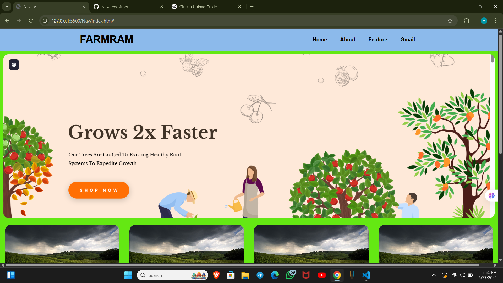

# FarmRAM Website 🌱

Responsive HTML/CSS project with beautiful card hover effects, navbar, and footer.

## 🧠 Overview

**FarmRAM** is a front-end responsive web interface designed for an agriculture-based solution. The project includes:
- A navigation bar
- A full-width banner image
- Multiple feature cards with 3D hover effects
- A professional footer with contact and quick links

This project is suitable for showcasing frontend development skills in a portfolio.

## ✨ Features

- 🚀 Responsive design with Flexbox layout
- 🖼️ Hover-based 3D card animations
- 🎨 Visually appealing color palette
- 📱 Mobile-friendly footer layout
- 🔗 Ready for GitHub Pages hosting

## 👨‍💻 Built With:
- HTML5
- CSS3

    ## 📸 Screenshot

